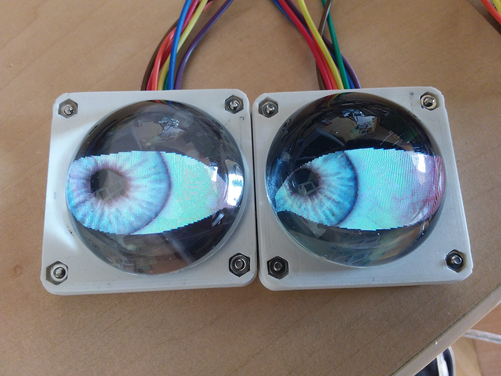

[](https://www.youtube.com/watch?v=E_-tKKZlwS4)

# teensy_eyes
Modification of the [Teensy3.1 Eyes with the LCD screens from Adafruit by Phil Burgess](https://learn.adafruit.com/animated-electronic-eyes-using-teensy-3-1/overview) to control the eyes through a serial bridge with ROS

# Install
Clone this somewhere in your ros workspace
`git clone https://github.com/arotyramel/teensy_eyes.git`

Go into your catkin root directory
```
catkin_make
roscd teensy_eyes/scripts
chmod +x bridge.py
```
# Flashing
[Install Arduino SDK](https://www.arduino.cc/en/Main/Software)

[Install Teensyduino](https://www.pjrc.com/teensy/td_download.html)

In the arduino tools select Board→Teensy 3.1 or 3.2 and CPU Speed→72 MHz (Optimized)

Go into the project workspace and open the file
"Teensy3.1_Eyes-master/uncannyEyes/uncannyEyes.ino"
with your arduino IDE and compile and upload it to your Teensy.

# Execution
Open 3 terminals
```
roscore
rosrun teensy_eyes bridge.py
rosrun teensy_eyes example.py
```
You should have a new topic called /eyes now.

# Example usage
```
rostopic pub -1 /eyes teensy_eyes/Eyes -- '{auto_eyes: false, iris: 512, x:512, y:300 }'
```
Allowed values for x, y and iris are 0 to 1023. 
If "auto_eyes" are set to true, x and y are ignored.

